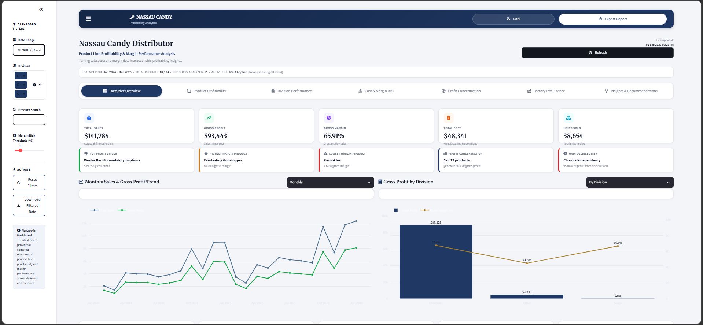
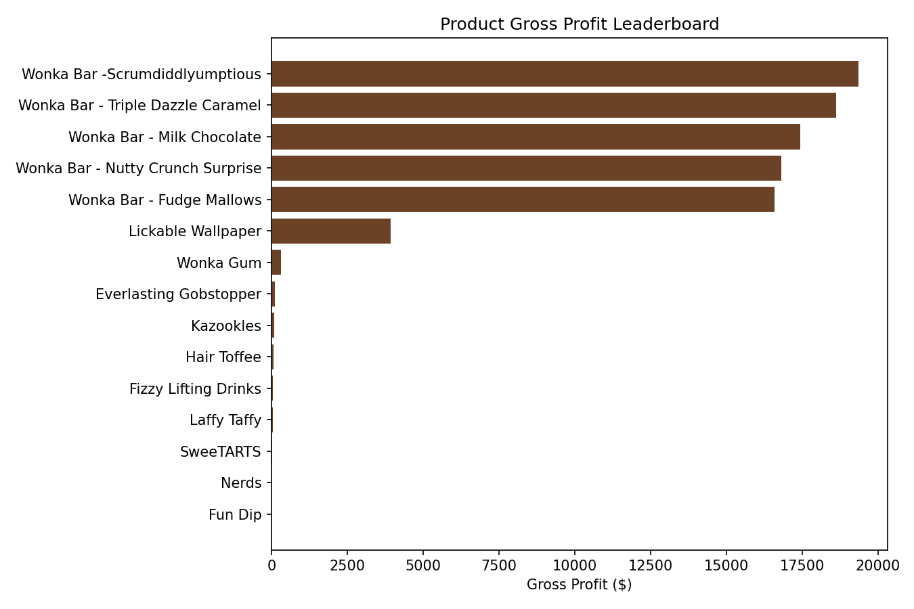
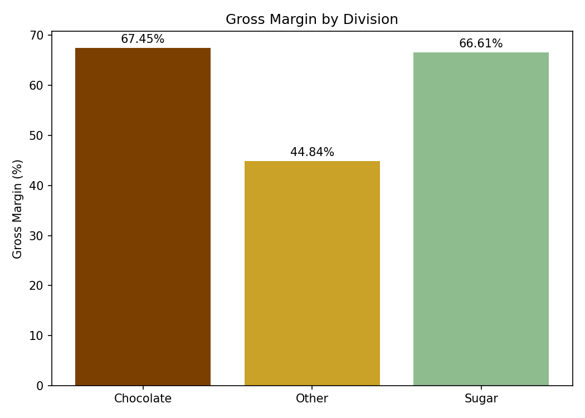
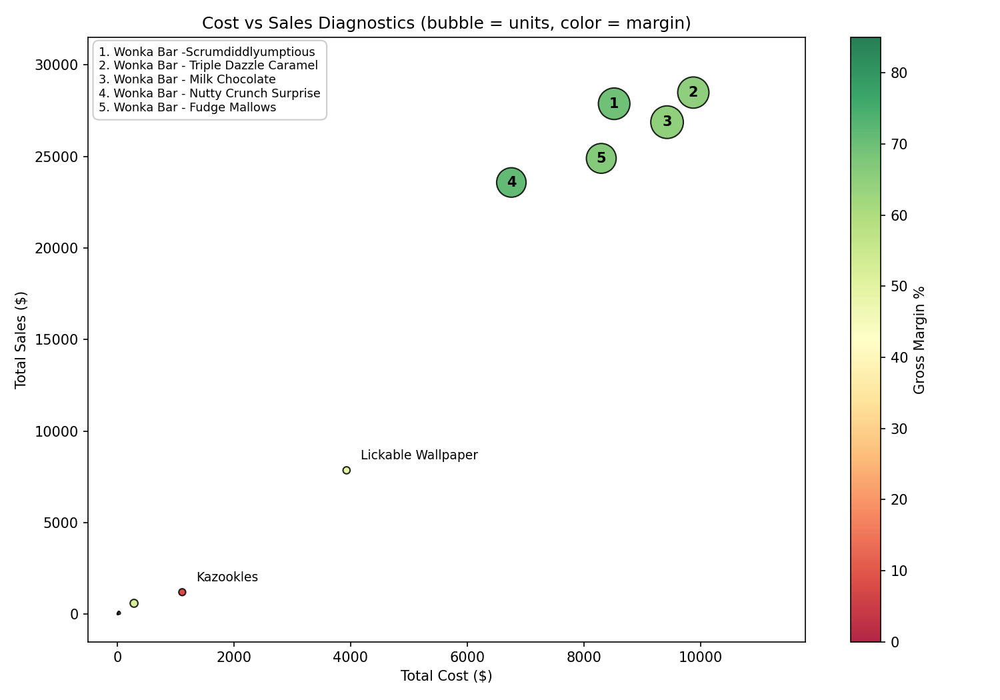
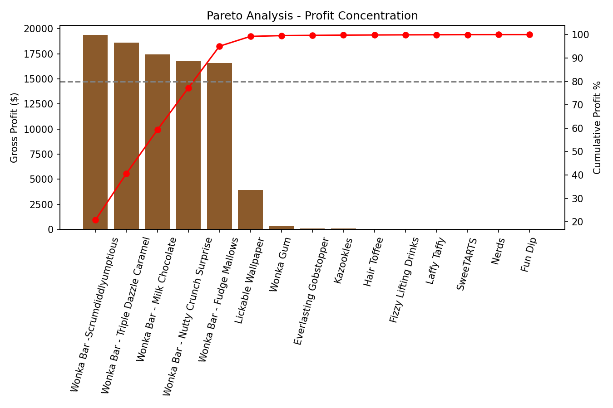
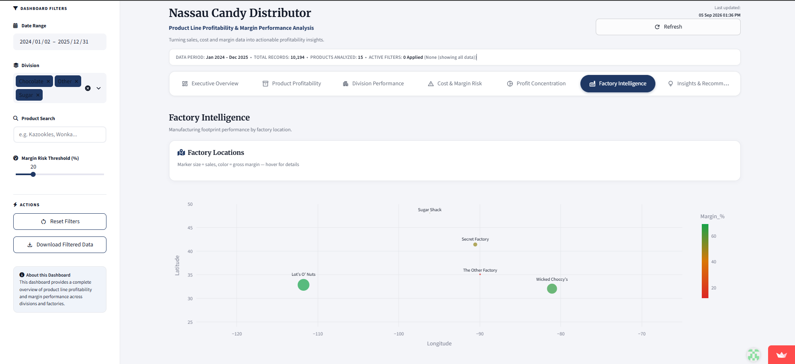
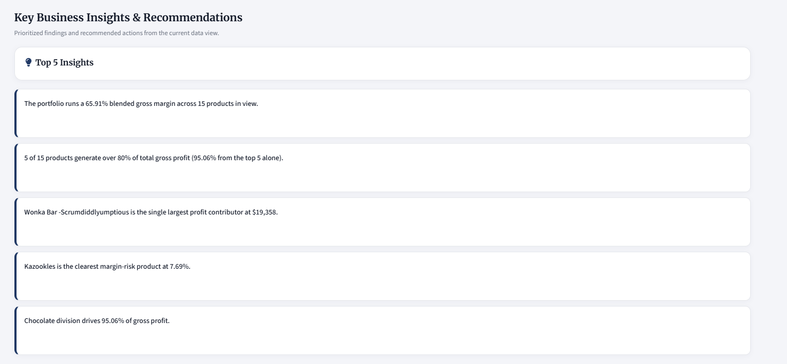

# 🍫 Nassau Candy — Product Line Profitability & Margin Performance Analysis

<p align="left">
  
  
  
  
  
  
</p>

> **Unified Mentor — Data Scientist Internship Project**
>
> An interactive executive analytics application that turns 10,194 raw transaction records into actionable profitability intelligence — which products, divisions, and factories actually make money, not just which ones sell.

<p>
  <a href="YOUR_STREAMLIT_APP_URL"><b>🔴 Live Dashboard</b></a> &nbsp;•&nbsp;
  <a href="YOUR_YOUTUBE_URL"><b>🎥 Demo Video</b></a> &nbsp;•&nbsp;
  <a href="reports/Research_Paper_Nassau_Candy.docx"><b>📄 Research Paper</b></a> &nbsp;•&nbsp;
  <a href="reports/Executive_Summary_Nassau_Candy.pdf"><b>📋 Executive Summary</b></a> &nbsp;•&nbsp;
  <a href="reports/Nassau_Candy_Presentation.pptx"><b>🖥️ Presentation</b></a> &nbsp;•&nbsp;
  <a href="notebooks/Nassau_Candy_Analysis.ipynb"><b>📊 Notebook</b></a>
</p>

> ⚠️ **Before publishing:** replace every `YOUR_..._URL` placeholder with your real links, and every `assets/*.png` with a real screenshot. Search this file for `YOUR_` to find every remaining spot.

---

## 📋 Table of Contents

- [Business Problem](#-business-problem)
- [Business Questions](#-business-questions)
- [Demo Video](#-demo-video)
- [Dashboard Preview](#️-dashboard-preview)
- [Validated Key Findings](#-validated-key-findings)
- [Dashboard Modules](#️-dashboard-modules)
- [Interactive Controls](#-interactive-controls)
- [Analytical Methodology](#-analytical-methodology)
- [Tech Stack](#️-tech-stack)
- [Run Locally](#️-run-locally)
- [Deployment](#️-deployment)
- [Project Structure](#-project-structure)
- [Business Recommendations](#-business-recommendations)
- [Project Deliverables](#-project-deliverables)
- [Author](#-author)

---

## 🎯 Business Problem

Sales volume alone can be misleading. Some products sell in high volume while generating weak
margins, consuming disproportionate cost, or creating hidden portfolio risk.

This project provides a data-driven view of **product profitability, margin performance,
division efficiency, cost structure, profit concentration, and factory intelligence** to support
better pricing, sourcing, promotion, and portfolio decisions — backed by 10,194 validated
transaction records.

## ❓ Business Questions

1. Which products truly drive gross profit?
2. Which products have strong sales but weak margins?
3. Which divisions are financially efficient or underperforming?
4. Where should pricing or manufacturing costs be reviewed?
5. How concentrated is profit across the product portfolio?
6. Which factories contribute the most profit?
7. How stable are gross margins over time?

---

## 🎥 Demo Video

<p align="center">
  <a href="YOUR_YOUTUBE_URL">
    
  </a>
  <br>
  <a href="YOUR_YOUTUBE_URL"><b>▶️ Watch the 90-second walkthrough on YouTube</b></a>
</p>

A quick tour of the executive KPIs, live filtering, the profitability quadrant analysis, and how
the margin-risk threshold recalculates recommendations in real time.

## 🖼️ Dashboard Preview

<p align="center">
  <a href="https://candy-profit-dashboard.streamlit.app/">
    
  </a>
  <br><i>Executive Overview — click to open the live dashboard</i>
</p>

| Product Profitability | Division Performance |
|:---:|:---:|
|  |  |

| Cost & Margin Risk | Profit Concentration (Pareto) |
|:---:|:---:|
|  |  |

| Factory Intelligence | Insights & Recommendations |
|:---:|:---:|
|  |  |

> 📸 Screenshot each of the 7 dashboard pages from your **live** app and save them into
> `assets/` using the exact filenames above.

---

## 📈 Validated Key Findings

| Metric | Result |
|---|---:|
| Total Sales | **$141,783.63** |
| Gross Profit | **$93,442.80** |
| Overall Gross Margin | **65.91%** |
| Highest Gross-Profit Product | **Wonka Bar -Scrumdiddlyumptious** — $19,357.50 |
| Highest Gross-Margin Product | **Everlasting Gobstopper** — 80.00% |
| Lowest-Margin Product | **Kazookles** — 7.69% |
| Chocolate Revenue Share | **92.88%** |
| Chocolate Profit Share | **95.06%** |
| Products Generating 80% of Profit | **5 of 15** |

**The headline insight:** just 5 of 15 products — all chocolate — generate over 80% of gross
profit, creating a meaningful portfolio concentration risk. A Pearson correlation test
(r = 0.385, p = 0.156) confirms that **sales volume has no statistically reliable relationship
with profit margin** — the two must be tracked separately, not assumed to move together.

*These figures are preserved from the validated project analysis; the dashboard recalculates
them dynamically whenever filters change.*

---

## 🖥️ Dashboard Modules

**📊 Executive Overview** — Sales, gross profit, gross margin, cost, and units KPIs · profit-driver
and margin-risk highlights · monthly sales/gross-profit trend · division/factory comparison ·
margin stability & volatility indicator · executive action matrix

**🍬 Product Profitability** — Gross-profit leaderboard · sales-vs-margin analysis · profitability
quadrant analysis · full product performance table

**🏢 Division Performance** — Revenue, cost, and gross-profit comparison · margin efficiency ·
contribution analysis

**⚠️ Cost & Margin Risk** — Cost-vs-sales diagnostics · margin-risk classification · high-sales /
low-margin identification with a specific recommended action per product

**📉 Profit Concentration** — Pareto analysis · 80% profit and revenue concentration · portfolio
dependency indicators

**🏭 Factory Intelligence** — Factory-level profitability · product-to-factory mapping · factory
location intelligence

**💡 Insights & Recommendations** — Prioritized business risks · pricing recommendations · cost
renegotiation opportunities · portfolio and promotion recommendations

## 🔎 Interactive Controls

- 📅 Date range filtering
- 🏷️ Division selection
- 🔍 Product search
- 🎚️ Adjustable margin-risk threshold
- ♻️ Reset filters
- 🌗 Dark / light display mode
- 📥 Filtered-data export
- 📤 Full-data export

---

## 🔬 Analytical Methodology

1. **Data cleaning & validation** — validated dates, sales, cost, units, missing values, and
   duplicates, including a `Sales − Cost = Gross Profit` integrity check across all 10,194 rows
2. **Profitability metrics** — gross margin, profit per unit, revenue contribution, and profit
   contribution
3. **Product analysis** — ranked products and classified them into profitability quadrants
4. **Division analysis** — compared revenue, cost, gross profit, and margins across divisions
5. **Pareto analysis** — identified how many products drive 80% of revenue/profit
6. **Cost diagnostics** — assessed cost-versus-sales relationships and flagged margin risk
7. **Factory analysis** — mapped every product to the supplied factory correlation table and
   evaluated factory-level performance
8. **Margin stability** — computed the standard deviation of monthly gross-margin percentages
9. **Statistical extension** — tested the relationship between sales volume and margin using a
   Pearson correlation

Full detail, code, and reasoning are in the [Jupyter notebook](notebooks/Nassau_Candy_Analysis.ipynb).

---

## 🛠️ Tech Stack

`Python` · `Pandas` · `NumPy` · `Streamlit` · `Plotly` · `Matplotlib` · `SciPy` · `Jupyter`

## ▶️ Run Locally

```bash
git clone https://github.com/<your-username>/Nassau_Candy_Product_Profitability_Analysis.git
cd Nassau_Candy_Product_Profitability_Analysis
pip install -r requirements.txt
streamlit run app.py
```

The application opens at `http://localhost:8501`.

> **Windows users:** if you see `Error: Invalid value: File does not exist: app.py`, it means
> your terminal is one folder above `app.py`. Run `dir` to check what's in your current folder —
> if you see another folder name instead of `app.py`, `cd` into it first, then run
> `streamlit run app.py` again.

## ☁️ Deployment

Deployed on **Streamlit Community Cloud**.

1. Push the contents of `Nassau_Candy_Product_Profitability_Analysis/` to a **public** GitHub
   repository — this folder itself must be the repo root, with `app.py` directly inside it.
2. Go to [streamlit.io/cloud](https://streamlit.io/cloud) → **New app**.
3. Select the repository and branch, and set the main file to `app.py`.
4. Click **Deploy** — done in about 2 minutes.
5. Test the public URL in an incognito/private browser window.
6. Replace every `YOUR_STREAMLIT_APP_URL` in this README with the real URL.

---

## 📁 Project Structure

```text
Nassau_Candy_Product_Profitability_Analysis/
├── README.md
├── app.py
├── requirements.txt
├── data_dictionary.csv
├── .gitignore
├── data/
│   ├── nassau_candy_cleaned.csv
│   ├── product_profitability_summary.csv
│   ├── division_performance_summary.csv
│   └── factory_performance_summary.csv
├── notebooks/
│   └── Nassau_Candy_Analysis.ipynb
├── reports/
│   ├── Research_Paper_Nassau_Candy.docx
│   ├── Executive_Summary_Nassau_Candy.pdf
│   └── Nassau_Candy_Presentation.pptx
└── assets/
    ├── dashboard_preview.png
    ├── product_profitability.png
    ├── division_performance.png
    ├── cost_margin_risk.png
    ├── profit_concentration.png
    ├── factory_intelligence.png
    └── insights_recommendations.png
```

> **Note:** the `data/` summary CSVs (`product_profitability_summary.csv`,
> `division_performance_summary.csv`, `factory_performance_summary.csv`) belong only in `data/`.
> If they've also been copied into `notebooks/`, delete the duplicates there — `notebooks/`
> should contain only `Nassau_Candy_Analysis.ipynb`.

## 💡 Business Recommendations

- Review **Kazookles** pricing and manufacturing cost — its margin is materially weaker than the
  rest of the portfolio.
- Protect the high-profit chocolate portfolio while actively monitoring concentration risk.
- Evaluate promotion opportunities for high-margin products that currently have lower sales.
- Shift promotional rules from sales-volume-based to margin-based.
- Track monthly margin volatility to catch pricing, cost, or product-mix instability early.

## 📦 Project Deliverables

- ✅ Interactive Streamlit dashboard
- ✅ Exploratory and statistical analysis notebook
- ✅ Research paper
- ✅ Executive summary
- ✅ Presentation
- ✅ Data dictionary
- ✅ Cleaned analytical dataset

---

## 👤 Author

**Iqra Siddiqui**
Data Science & Analytics · Python · SQL · Power BI · Tableau

<p>
  <a href="https://linkedin.com/in/siddiquiiqra"></a>
  <a href="YOUR_GITHUB_PROFILE_URL"></a>
</p>

---

<p align="center"><i>Unified Mentor Data Scientist Internship Project</i></p>
